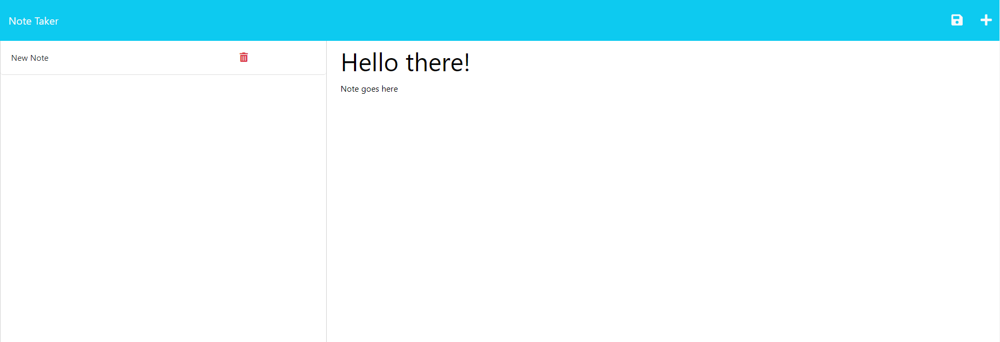

# Note Taker

## Description

This application is designed to let a user take notes and save them to local storage, as well as delete them, from the access of a website.

---
# Table of Contents

  * [Installation](#installation)
  * [Usage](#usage)
  * [License](#license)
  * [Contribution](#contribution)
  * [Tests](#tests)
  * [Questions](#questions)

---
  ## [Installation](#table-of-contents)

  No need to install, you may access this at [Heroku Link](https://ar98-note-taker.herokuapp.com/)

---
  ## [Usage](#table-of-contents)

  To use the website, just click the button to take notes, and then enter in the fields what information you would like to save, and click the save button!

  

---
  ## [License](#table-of-contents)

  The application is covered under the following license:

  [MIT](https://choosealicense.com/licenses/MIT)

---
  ## [Contribution](#table-of-contents)

  Please contact me about contributing to this repo using the contact info below!

---
  ## [Tests](#table-of-contents)

  To test this application, clone the repository, and then use the command npm i to install your dependencies using the package.json.  Once you have done that, you may use node server.js to start the local server!

---
  ## [Questions](#table-of-contents)

  Please use the following links for contact:

  [GitHub](https://github.com/areed98)

  [Email: austinjreed89@gmail.com](mailto:austinjreed89@gmail.com)